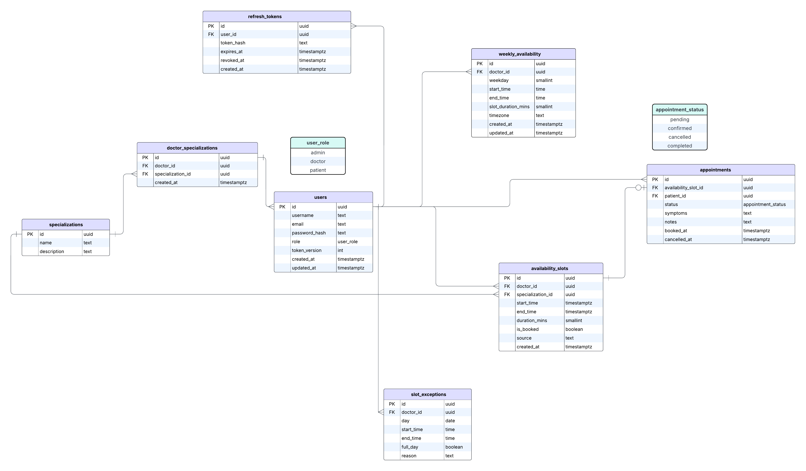
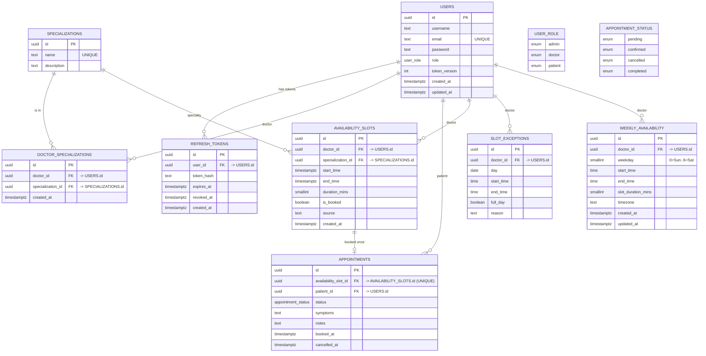

# Data Modeling

## Table of Contents

- [Database](#database)
- [Entity Relationship Diagram](#entity-relationship-diagram)
- [Tables](#tables)
  - [Users](#1-users)
  - [Specializations](#2-specializations)
  - [Doctor_specializations](#3-doctor_specializations)
  - [Weekly_availability](#4-weekly_availability)
  - [Slot_exceptions](#5-slot_exceptions)
  - [Availability_slots](#6-availability_slots)
  - [Appointments](#7-appointments)
  - [Refresh_tokens](#8-refresh_tokens)
- [Types](#types--enumeration-)
  - [User role](#1-user-role)
  - [Appointment status](#2-appointment-status)
- [Relationships](#relationships)

---

## Database

- Database - PostgreSQL

## Entity Relationship Diagram

## Tables

### 1. Users

Stores all accounts: admin, doctor, patient.

| Key | Column Name   | Data Type   | Description                           |
| --- | ------------- | ----------- | ------------------------------------- |
| PK  | id            | uuid        | Primary key                           |
|     | username      | text        | Display name                          |
|     | email         | text        | Unique user email                     |
|     | password      | text        | Hashed password                       |
|     | role          | user_role   | User's role                           |
|     | token_version | int         | For instant access-token invalidation |
|     | created_at    | timestamptz | Record created                        |
|     | updated_at    | timestamptz | Record updated                        |

### 2. Specializations

Controlled vocabulary for doctor specialties.

| Key | Column Name | Data Type | Description                |
| --- | ----------- | --------- | -------------------------- |
| PK  | id          | uuid      | Primary Key                |
|     | name        | text      | Unique specialization name |
|     | description | text      | Optional description       |

### 3. Doctor_specializations

M:N link between doctors and specializations.

| Key | Column Name       | Data Type   | Description             |
| --- | ----------------- | ----------- | ----------------------- |
| PK  | id                | uuid        | Primary key             |
| FK  | doctor_id         | uuid        | FK → users.id (doctor)  |
| FK  | specialization_id | uuid        | FK → specializations.id |
|     | created_at        | timestamptz | Record created          |

### 4. Weekly_availability

Doctor’s recurring working hours (templates used to generate slots).

| Key | Column Name        | Data Type   | Description                           |
| --- | ------------------ | ----------- | ------------------------------------- |
| PK  | id                 | uuid        | Primary key                           |
| FK  | doctor_id          | uuid        | FK → users.id (doctor)                |
|     | weekday            | smallint    | 0..6 (Sun..Sat)                       |
|     | start_time         | time        | Local start time                      |
|     | end_time           | time        | Local end time (must be > start_time) |
|     | slot_duration_mins | smallint    | e.g., 15/20/30                        |
|     | timezone           | text        | e.g., Europe/Istanbul                 |
|     | created_at         | timestamptz | Record created                        |
|     | updated_at         | timestamptz | Record updated                        |

### 5. Slot_exceptions

One-off overrides to the weekly template (vacations, clinics, partial blocks).

| Key | Column Name | Data Type | Description                                                  |
| --- | ----------- | --------- | ------------------------------------------------------------ |
| PK  | id          | uuid      | Primary key                                                  |
| FK  | doctor_id   | uuid      | FK → users.id (doctor)                                       |
|     | day         | date      | The date affected                                            |
|     | start_time  | time      | Optional start (required if full_day = false)                |
|     | end_time    | time      | Optional end (required if full_day = false, must be > start) |
|     | full_day    | boolean   | If true, the whole day is blocked                            |
|     | reason      | text      | Optional note                                                |

### 6. Availability_slots

Concrete bookable slots (rolling horizon). One slot can be booked at most once.

| Key | Column Name       | Data Type   | Description                              |
| --- | ----------------- | ----------- | ---------------------------------------- | ------------------- |
| PK  | id                | uuid        | Primary key                              |
| FK  | doctor_id         | uuid        | FK → users.id (doctor)                   |
| FK  | specialization_id | uuid        | FK → specializations.id                  |
|     | start_time        | timestamptz | Absolute start time                      |
|     | end_time          | timestamptz | Absolute end time (must be > start_time) |
|     | duration_mins     | smallint    | For quick reads                          |
|     | is_booked         | boolean     | Cached availability flag                 |
|     | source            | text        | 'generated'                              | 'manual' (optional) |
|     | created_at        | timestamptz | Record updated                           |

### 7. Appointments

A patient booking a slot.

| Key | Column Name          | Data Type          | Description                           |
| --- | -------------------- | ------------------ | ------------------------------------- |
| PK  | id                   | uuid               | Primary key                           |
| FK  | availability_slot_id | uuid               | UNIQUE FK → availability_slots.id     |
| FK  | patient_id           | uuid               | FK → users.id (patient)               |
|     | status               | appointment_status | Appointment status                    |
|     | symptoms             | text               | Optional notes from patient           |
|     | notes                | text               | Staff/doctor notes                    |
|     | booked_at            | timestamptz        | When the appointment was created      |
|     | cancelled_at         | timestamptz        | When it was cancelled (if applicable) |

UNIQUE (availability_slot_id) enforces one appointment per slot.

### 8. Refresh_tokens

Server-side store for hashed refresh tokens (replaces JSON files).

| Key | Column Name | Data Type   | Description                                 |
| --- | ----------- | ----------- | ------------------------------------------- |
| PK  | id          | uuid        | Primary key                                 |
| FK  | user_id     | uuid        | FK → users.id                               |
|     | token_hash  | text        | Hash of the refresh token (never plaintext) |
|     | expires_at  | timestamptz | Expiration                                  |
|     | revoked_at  | timestamptz | Revocation time (if revoked)                |
|     | created_at  | timestamptz | Record created                              |

## Types (Enumeration)

### 1. User role

| user_role |
| --------- |
| admin     |
| doctor    |
| patient   |

### 2. Appointment status

| appointment_status |
| ------------------ |
| pending            |
| confirmed          |
| cancelled          |
| completed          |

## Relationships

The relationships between the tables are:

- Users (doctor) ⟶ Weekly_availability (one-to-many)
  One doctor can define many weekly templates
  at weekly_availability(doctor_id).
- Users (doctor) ⟶ Slot_exceptions (one-to-many)
  One doctor can create many one-off overrides (vacation/blocked hours)
  at slot_exceptions(doctor_id).
- Users (doctor) ⟶ Availability_slots (one-to-many)
  One doctor owns many concrete bookable slots
  at availability_slots(doctor_id).
- Specializations ⟶ Availability_slots (one-to-many)
  Each slot is for exactly one specialization
  at availability_slots(specialization_id).
- Availability_slots ⟶ Appointments (one-to-zero/one)
  A slot can be booked at most once
  at appointments(availability_slot_id) (with a UNIQUE constraint on availability_slot_id).
- Users (patient) ⟶ Appointments (one-to-many)
  A patient can have many appointments over time
  at appointments(patient_id).
- Users (doctor) ⟷ Specializations (many-to-many) via Doctor_specializations
  A doctor can have many specializations, and a specialization can have many doctors,
  through doctor_specializations with fields doctor_id and specialization_id.
  (You’re using a single-column PK id in this table—fine. Optionally add a UNIQUE on (doctor_id, specialization_id) to prevent duplicates.)
- Users ⟶ Refresh_tokens (one-to-many)
  A user can have multiple refresh tokens (devices/browsers)
  at refresh_tokens(user_id).
